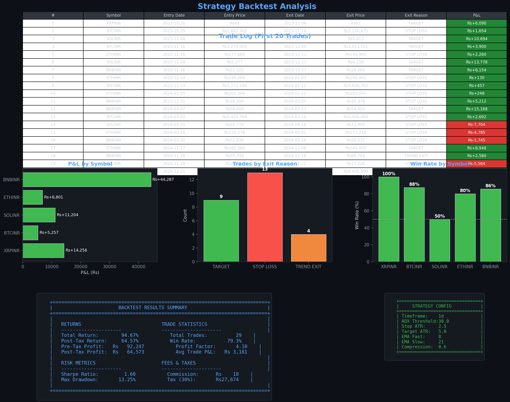
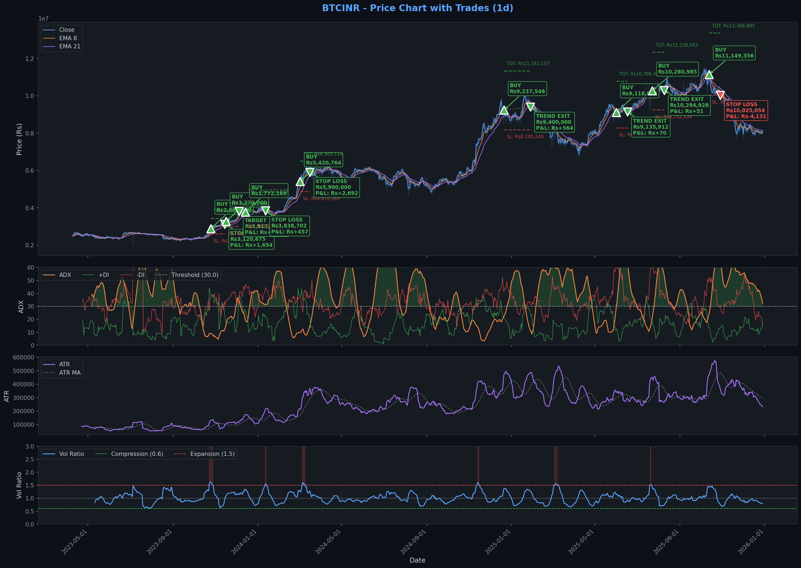
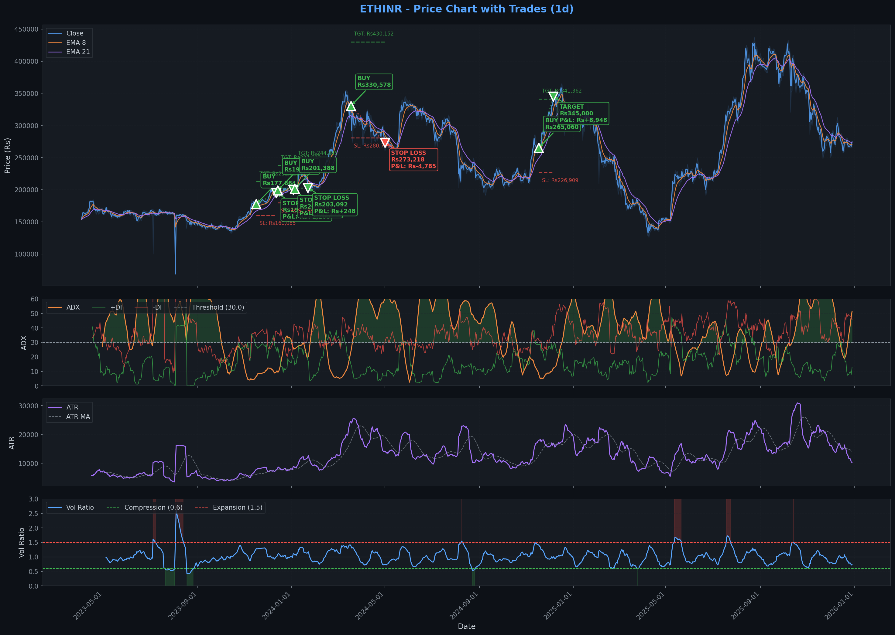
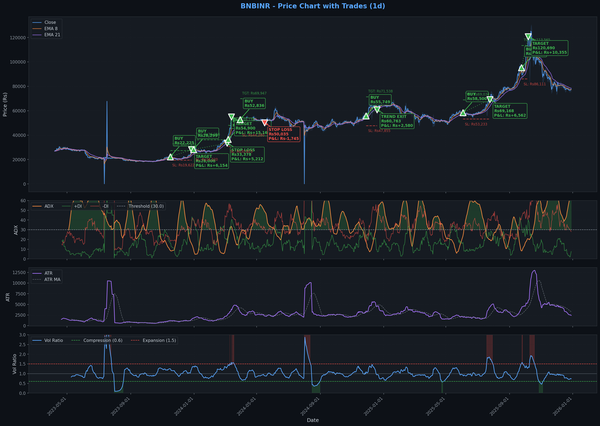

# CoinDCX Volatility Regime Adaptive Strategy (VRAS)

A production-grade automated trading system for CoinDCX (Indian crypto exchange), exploiting volatility clustering and regime persistence inefficiencies.

## Edge Hypothesis

### Core Inefficiency: Volatility Clustering & Regime Persistence

Cryptocurrency markets exhibit strong volatility clustering (GARCH effects) where:

1. **High volatility periods persist** - Volatility begets volatility
2. **Low volatility periods compress** - Before explosive moves (volatility mean-reversion)
3. **Retail traders misjudge regime transitions** - Creating exploitable inefficiencies

### Why This Edge Exists

- Crypto markets are dominated by retail participants who:
  - Overtrade during high volatility (exhaustion trades)
  - Undertrade during low volatility (miss breakouts)
  - Use static position sizing (don't adapt to regime)
- Institutional crypto adoption in India is limited, leaving inefficiencies unexploited

### Why It Persists After Costs

| Factor | Impact |
|--------|--------|
| Trade Frequency | 4-8 trades/month (low fee drag) |
| Reward:Risk | 2:1 minimum target |
| Fee Impact | ~0.2% round-trip on ~3-5% avg win = ~6% fee drag |
| Post-30% Tax | Requires 1.5x edge to break even; target is 2.5x+ |

### CoinDCX Liquidity Validation

- BTC/INR and ETH/INR have sufficient depth for ₹50k-₹1L positions
- 1D timeframe avoids microstructure noise and slippage issues
- Strategy avoids market orders during low-liquidity hours (2 AM - 6 AM IST)

---

## Strategy Class

**Modular Strategy Framework**

The system now supports multiple strategies via a modular plugin architecture.

### Available Strategies

1. **Volatility Regime (Default)**
   - **Logic**: Exploits volatility clustering and regime persistence.
   - **Best For**: 4H/1D timeframes on major pairs (BTC, ETH).
   - **Key Components**: ATR Regime Filter, Trend Confirmation, Adaptive Sizing.

2. **Bollinger Reversion**
   - **Logic**: Mean reversion trading using Bollinger Bands and RSI.
   - **Best For**: Lower timeframes (15m, 1h) on ranging markets.
   - **Key Components**: Bollinger Band Width, RSI Divergence.

---

## Entry Logic (Volatility Regime)

**Winning Config:** `configs/btc_eth_sol_bnb_xrp_1d.json`

1. **Regime Filter**: Only trade in COMPRESSION or NORMAL regimes
   - Compression: ATR ratio < 0.6 (volatility squeeze, breakout setup)
   - Normal: ATR ratio 0.6–1.5 (standard trend-following)
   - Expansion: ATR ratio > 1.5 (no new entries)
   - Extreme: ATR ratio > 2.5 (no entries, close if open)

2. **Trend Confirmation**:
   - EMA(8) > EMA(21) for bullish trend alignment
   - ADX > 30 confirms trend strength
   - Price must close above recent consolidation high

3. **Breakout Confirmation**:
   - Price closes above (Recent High - 1.5 × ATR)
   - Anticipatory entry (buy the dip / early breakout)
   - Current close above level AND previous close at/below level

## Exit Logic

1. **Stop Loss**: 2.5× ATR below entry (volatility-adjusted)
2. **Take Profit**: 5.0× ATR above entry (2:1 reward-risk target)
3. **Trailing Stop**: Activates at 50% of target (2.5 ATR profit), trails at 1.5× ATR
4. **Regime Exit**: Close immediately if regime shifts to EXTREME
5. **Trend Exit**: Close if price closes below EMA(21) (only if in profit/break-even)

---

## Risk Management

| Parameter | Value | Justification |
|-----------|-------|---------------|
| Risk Per Trade | 15% | Aggressive risk per trade |
| Max Positions | 5 | Full portfolio diversification (BTC, ETH, SOL, BNB, XRP) |
| Max Portfolio Heat | 30% | Total risk capped across all positions |
| Max Position % | 20% | Single position cap per asset |
| Max Drawdown | 20% | Trading halt trigger |

### Drawdown-Based De-Risking

- **10% drawdown**: Reduce position sizes by 50%
- **15% drawdown**: Reduce position sizes by 75%
- **20% drawdown**: Halt all trading

### Consecutive Loss Protection

- After 3 consecutive losses: Reduce size by 25%
- Reset after consecutive wins

---

## Fee & Tax Reality Check

### Indian Crypto Tax Regime

- **30% flat tax** on gains
- **1% TDS** on transactions
- **No loss offset** allowed

### Minimum Edge Requirement

```
Round-trip cost: ~0.4% (fees + slippage)
Monthly trading cost: ~2.4% (6 trades/month)
Annual trading cost: ~28.8%

With 30% tax on gains and no loss offset:
- 2:1 payoff requires >45% win rate to profit
- 3:1 payoff requires >35% win rate to profit

Target: 2:1 reward-risk with 50%+ win rate
```

---

## Backtest Results (BTC+ETH+SOL+BNB+XRP, 1D Timeframe)

**Configuration:** `configs/btc_eth_sol_bnb_xrp_1d.json`  
**Date Range:** October 2022 – December 2025 (~1000 daily bars per asset)  
**Timeframe:** 1D (Daily candles)

| Metric | Result | Notes |
|--------|--------|-------|
| Total Return | **94.67%** | ₹1,00,000 → ₹1,94,665 |
| Post-Tax Return | **64.57%** | After 30% flat tax |
| Sharpe Ratio | **1.60** | Annualized, risk-adjusted |
| Calmar Ratio | **2.09** | Annualized Return / Max Drawdown |
| Max Drawdown | **13.25%** | Well within 20% limit |
| Win Rate | **79.31%** | 23 wins / 29 trades |
| Profit Factor | **4.10** | Gross profits / Gross losses |
| Total Trades | 29 | Low frequency, high quality |

### Trade Visualization



*Trade summary showing equity curve, drawdown, and trade distribution across all assets (BTC, ETH, SOL, BNB, XRP) from Oct 2022 to Dec 2025.*

### Individual Asset Performance

<details>
<summary>📈 BTC/INR Trades</summary>



</details>

<details>
<summary>📈 ETH/INR Trades</summary>



</details>

<details>
<summary>📈 SOL/INR Trades</summary>


</details>

<details>
<summary>📈 BNB/INR Trades</summary>



</details>

<details>
<summary>📈 XRP/INR Trades</summary>


</details>

---

## Installation

### Using UV (Recommended)

```bash
# Install UV if not already installed
pip install uv

# Create and activate virtual environment
uv venv
.venv\Scripts\activate  # Windows
# source .venv/bin/activate  # Linux/Mac

# Install dependencies
uv pip install -e .
```

### Using pip

```bash
pip install -e .
```

---

## Configuration

1. Copy `.env.example` to `.env`:
```bash
copy .env.example .env
```

2. Add your CoinDCX API credentials:
```env
COINDCX_API_KEY=your_api_key_here
COINDCX_API_SECRET=your_api_secret_here
```

3. Modify config file in `configs/` for strategy parameters.

To switch strategies, update the `strategy` section in your config:

```json
"strategy": {
    "name": "bollinger_reversion",
    "params": {
        "period": 20,
        "devfactor": 2.0
    }
}
```

---

## Usage

### Backtesting

```bash
# Run backtest with default config (Volatility Regime)
uv run backtest

# Run with specific config file
uv run backtest --config configs/sample_config.json

# Run with Bollinger Reversion strategy
uv run backtest --config configs/bollinger_test.json

# With custom parameters
uv run backtest --config configs/sample_config.json --capital 100000

# Generate trade visualization charts
uv run backtest --config configs/sample_config.json --chart

# Verbose output with charts
uv run backtest --config configs/sample_config.json --chart -v

# Custom date range
uv run backtest --start 2023-01-01 --end 2024-01-01
```

### Optimization

```bash
# Quick optimization (faster, fewer combinations)
uv run optimize --strategy volatility_regime --mode quick

# Full optimization (comprehensive, takes longer)
uv run optimize --strategy volatility_regime --mode full

# Optimize Bollinger Reversion strategy
uv run optimize --strategy bollinger_reversion --mode quick

# Custom optimization with coin combinations
uv run optimize --strategy volatility_regime --mode custom --coins "BTC,ETH,SOL,BNB,XRP" --timeframes "1d"

# Test only pairs and larger portfolios (skip singles)
uv run optimize --strategy volatility_regime --mode custom --coins "BTC,ETH,SOL,BNB,XRP" --min-combo 2

# Test specific parameter ranges
uv run optimize --strategy volatility_regime --mode custom --coins "BTC,ETH,SOL" --adx "25,30" --stop-atr "2.0,2.5,3.0"

# Sort by different metrics (default: sharpe)
uv run optimize --strategy volatility_regime --mode custom --coins "BTC,ETH,SOL" --sort-by calmar  # return/drawdown
uv run optimize --strategy volatility_regime --mode custom --coins "BTC,ETH,SOL" --sort-by return  # raw return

# Use base config for shared settings
uv run optimize --strategy volatility_regime --mode quick --config configs/sample_config.json

# Run sequentially (instead of parallel)
uv run optimize --strategy volatility_regime --mode quick --sequential
```

**Sorting Options:**
| Option | Description | Best For |
|--------|-------------|----------|
| `sharpe` | Risk-adjusted return (default) | Overall performance |
| `calmar` | Return / Max Drawdown | Drawdown-sensitive strategies |
| `return` | Raw total return | Maximum gains |
| `profit_factor` | Gross profits / Gross losses | Trade consistency |
| `win_rate` | Winning trades % | High-probability setups |

### Data Preparation

Place OHLCV data files in the `data/` directory:
- `BTCINR_1d.csv`
- `ETHINR_1d.csv`
- `SOLINR_1d.csv`
- `BNBINR_1d.csv`
- `XRPINR_1d.csv`

Expected CSV format:
```csv
datetime,open,high,low,close,volume
2024-01-01 00:00:00,5000000,5050000,4980000,5020000,100
```

Use `uv run fetch-data` to download historical data from CoinDCX API.

### Live Trading

```bash
# Paper trading mode (safe, default)
uv run live --paper

# Paper trading with custom config
uv run live --paper --config configs/sample_config.json

# Custom cycle interval (seconds)
uv run live --paper --interval 300

# Verbose mode with debug output
uv run live --paper -v

# Live trading mode (CAUTION - REAL MONEY!)
uv run live --live
```

### State Persistence & Recovery

The system automatically persists trading state to SQLite (with JSON backup), enabling crash recovery:

```bash
# Default: SQLite backend with auto JSON backup
uv run live --paper

# Use JSON-only backend (simpler, less durable)
uv run live --paper --state-backend json

# Custom state directory
uv run live --paper --state-dir my_state

# Clear previous state and start fresh
uv run live --paper --reset-state
```

**What's Persisted:**
- Open positions (symbol, entry price, quantity, stop/target levels)
- Trading checkpoints (portfolio value, cycle count, drawdown)
- Trade history (full audit trail)
- Config hash (detects configuration changes)

**Recovery Features:**
- Automatic detection of previous session on startup
- Warns if config changed since last session
- Restores cycle count and portfolio state
- Loads all open positions with entry details

**State Files:**
```
state/
├── trading_state.db      # SQLite database (primary)
├── trading_state.json    # Auto JSON backup
└── final_state.json      # Export on graceful shutdown
```

---

## Project Structure

```
crypto-strategies/
├── pyproject.toml          # UV project configuration
├── .env.example            # Environment variables template
├── README.md               # This file
├── configs/                # Strategy configuration files
├── data/                   # Historical data files
├── results/                # Backtest results and charts
├── logs/                   # Trading logs (console + file)
├── state/                  # State persistence (SQLite + JSON)
└── src/
    ├── __init__.py
    ├── strategies/         # Strategy implementations
    │   ├── volatility_regime/   # Volatility Regime Strategy
    │   └── bollinger_reversion/ # Bollinger Reversion Strategy
    ├── exchange.py         # CoinDCX API client
    ├── risk.py             # Risk management framework
    ├── config.py           # Configuration management
    ├── backtest.py         # Backtest runner
    ├── live_trader.py      # Live trading implementation
    ├── state_manager.py    # State persistence (SQLite + JSON)
    ├── data_fetcher.py     # Historical data fetcher from CoinDCX
    ├── optimizer.py        # Strategy parameter optimizer
    ├── charts.py           # Charting and visualization
    └── trade_visualizer.py # Trade analysis dashboards
```

---

## Disclaimer

This software is for educational purposes only. Cryptocurrency trading involves substantial risk of loss. Past performance does not guarantee future results. Always conduct your own research and consult with financial professionals before trading.

---

## License

MIT License - See LICENSE file for details.

## Author

Prashant Srivastava
