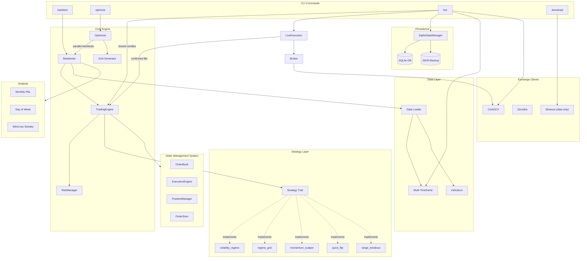
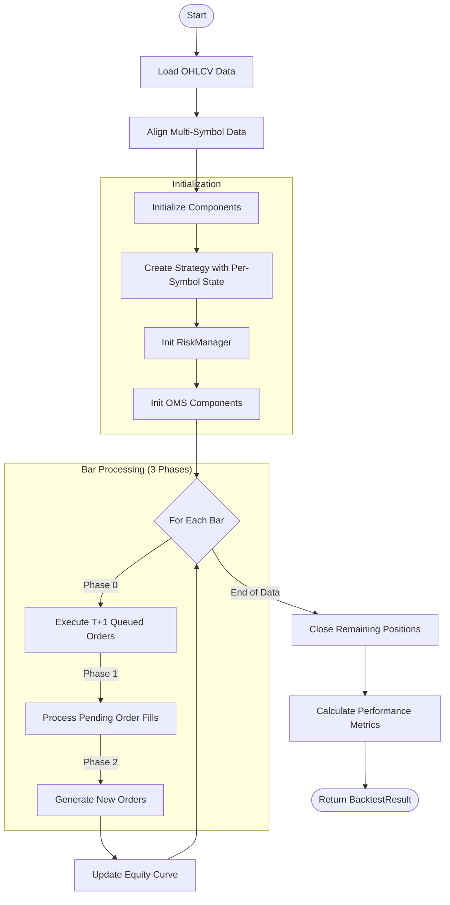
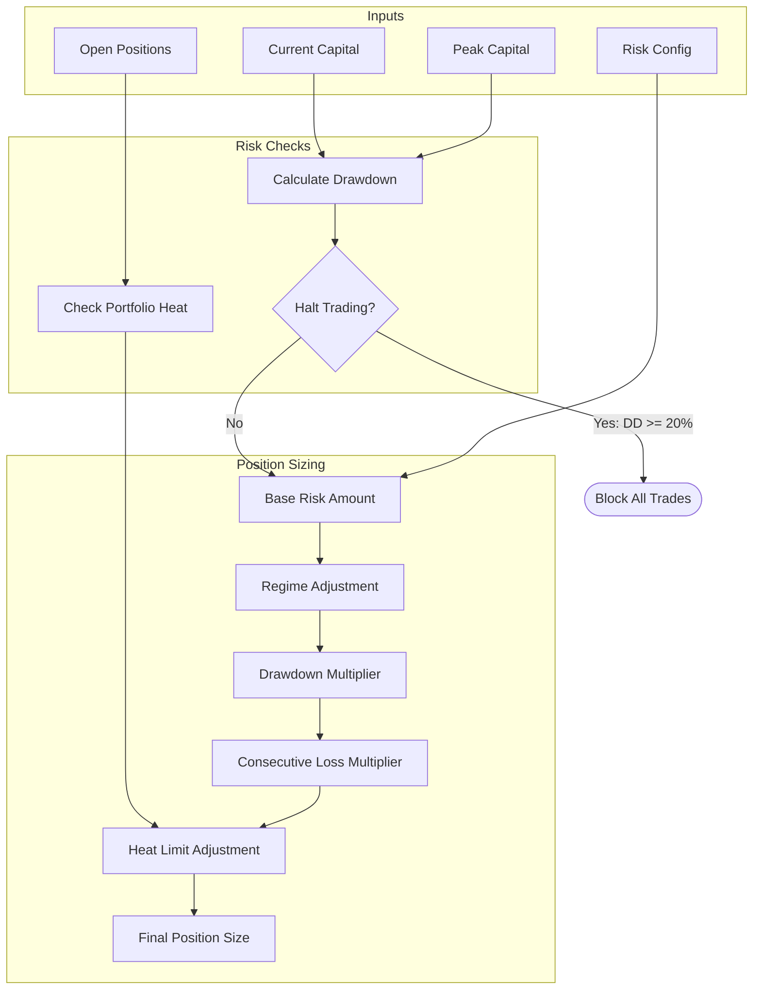
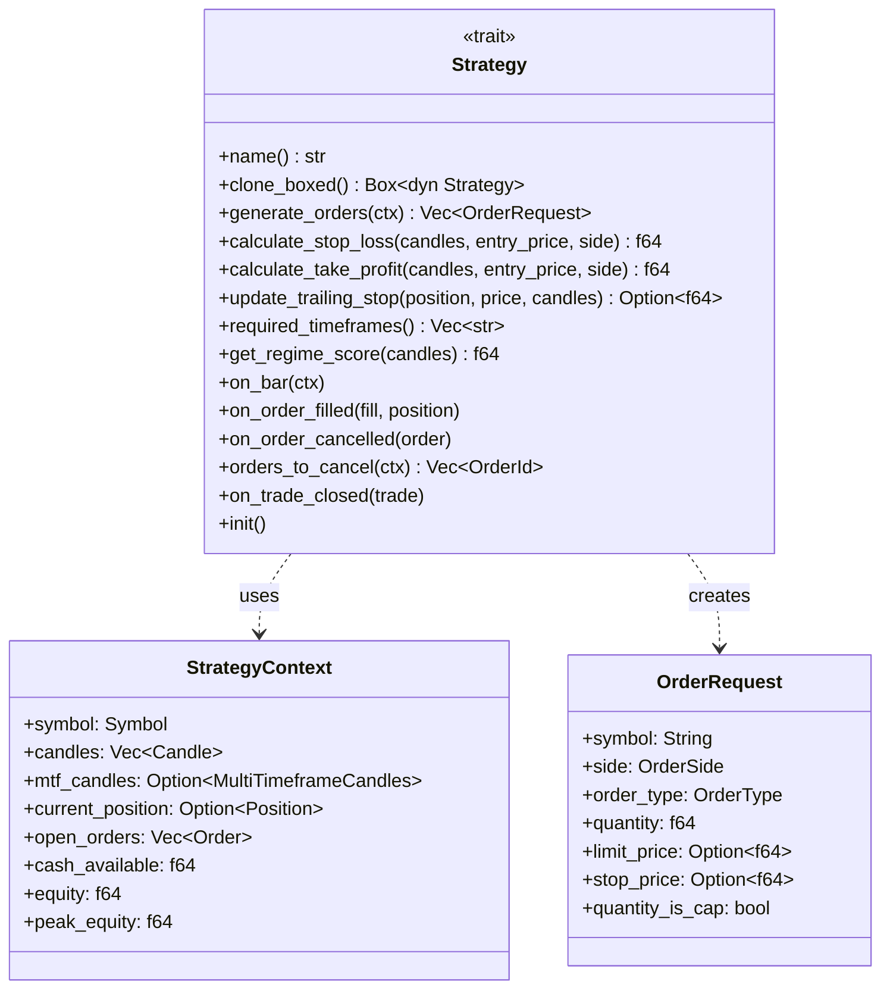
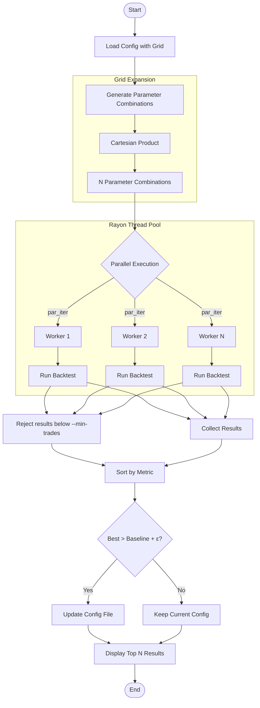
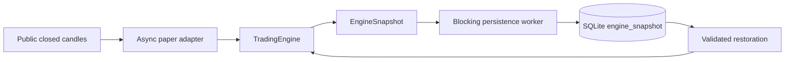
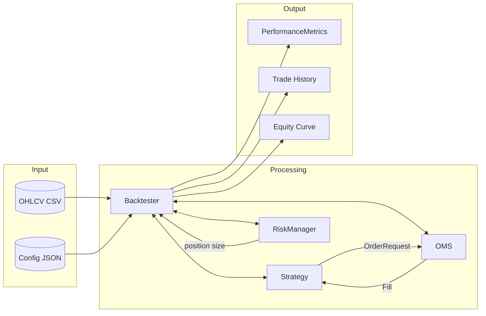

# Architecture

This document provides a visual overview of the system architecture.

`oms::TradingEngine` is the single synchronous trading core. Backtest and streaming
paper adapters supply closed-candle events; neither implements strategy decisions,
risk sizing, stops, or accounting independently. Async HTTP and persistence stay
outside the core. Both crates forbid unsafe code and CI rejects lint warnings.
External spot execution uses the same core without simulated fills. A broker-neutral
`oms::broker::Broker` contract supplies market rules, quotes, balances and normalized
order reports; `oms::live_execution::LiveExecution` journals and reconciles the I/O.
CoinDCX is the first execution adapter. Zerodha remains a client library, not a
second live execution implementation.

Each mutation intent and immutable client-ID payload commits atomically with the
engine before HTTP. Unknown creates are looked up, never blindly resubmitted.
Cancellation acknowledgements do not release inventory or risk reservations.
Full journal history survives beyond the core's bounded simulation cursor cache.
Late fees follow entry-lot disposal links into remaining lots or completed trades.
Real state is bound to the broker account and credential-free configuration; a
local account lock and a database lock prevent duplicate local writers.

Real decisions use the latest closed candle only; missed historical signals are
not replayed into live orders. Live quotes drive the core's protective-exit rules.
Native stop-limit orders hold inventory, while strategy reductions wait locally
until executable. Stops are cancelled and reconciled before an ordinary sell is
sent, because no atomic spot OCO contract has been established. This entails a
non-atomic handoff and native stop-limits can miss gaps. Partial non-protective
orders are cancelled/reconciled before inventory is reprotected. Only actual
owned spot inventory may be sold; no synthetic shorting or borrowing is allowed.

FIFO matching, commission allocation, and full-close order quantities retain decimal
precision; liquidation never writes off residual quantities using a floating-point tolerance.
Entries are revalidated at their executable prices against current risk, fees,
reservations, and exposure; a gap can resize or cancel an entry. Risk-reducing short
covers are not blocked by entry cash limits: synthetic insolvency is realized and
new entries halt. Mutually opposing pending entries require an explicit OCO policy
and are rejected rather than silently reversing protection.

An exit order is the trade/risk-streak boundary, not each execution report or the
whole lifetime of grid inventory. Partial fills settle cash and FIFO immediately,
but their combined trade is recorded once the order completes or is cancelled.
Independent completed grid reductions remain separate trades. Partial-exit
accumulators, active execution cursors, and the last 4,096 terminal order cursors
survive snapshots. Retention follows completion order, including cancelled partials,
not order creation IDs. Exact replays are ignored; conflicts or unknown/evicted IDs fail closed.
When OHLC leaves intrabar ordering ambiguous, an existing protective stop takes
precedence over resting reductions; orders executable at the open retain priority.
All symbols' opening reductions and protection precede opening additions, which
are sized against the post-exit portfolio. Opening protection also checks new
positions before intrabar fills. Intrabar
thresholds are crossed in price order on the adverse leg first, not by order IDs;
a nearer resting stop can reduce before the protective stop. Fills are marked at
execution, not a pre-entry opening price. A new intrabar entry
cannot profit from a prior open or a favorable extreme of unknown timing: only
entry and subsequent close prices establish favorable moves, while adverse
extremes are used conservatively. Protection is processed before final close marks;
close-derived trailing changes remain prospective.

Nonpositive terminal equity leaves the full debt and loss in the results. Calmar
is then undefined (displayed as `N/A`, stored as negative infinity for ranking).
Undefined `NaN` scores also rank last through the shared optimizer comparator;
valid infinite ratios, such as profit factor with no losses, retain their ordering.
Finite, strictly positive terminal equity is an eligibility requirement for every
optimization objective and config update, independent of a positive win rate or
other score. Eligibility uses exact terminal equity, not a rounded return.

## System Overview

```mermaid
flowchart TB
    subgraph CLI["CLI Commands"]
        backtest["backtest"]
        optimize["optimize"]
        live["live"]
        download["download"]
    end

    subgraph Core["Core Engine"]
        Backtester
        TradingEngine
        Optimizer
        RiskManager
        GridGenerator["Grid Generator"]
    end

    subgraph OMS["Order Management System"]
        OrderBook
        ExecutionEngine
        PositionManager
        OrderSizer
    end

    subgraph Strategies["Strategy Layer"]
        StrategyTrait["Strategy Trait"]
        VolatilityRegime["volatility_regime"]
        RegimeGrid["regime_grid"]
        MomentumScalper["momentum_scalper"]
        QuickFlip["quick_flip"]
        RangeBreakout["range_breakout"]
    end

    subgraph Data["Data Layer"]
        DataLoader["Data Loader"]
        MultiTimeframe["Multi-Timeframe"]
        Indicators["Indicators"]
    end

    subgraph Analysis["Analysis"]
        MonthlyPnL["Monthly P&L"]
        DayOfWeek["Day of Week"]
        Streaks["Win/Loss Streaks"]
    end

    subgraph Persistence["Persistence"]
        StateManager["SqliteStateManager"]
        SQLite[(SQLite DB)]
        JSON[(JSON Backup)]
    end

    subgraph Exchange["Exchange Clients"]
        CoinDCX
        Zerodha
        Binance["Binance (data only)"]
    end

    backtest --> Backtester
    optimize --> Optimizer
    live -->|closed candles| TradingEngine
    live --> LiveExecution
    LiveExecution -->|confirmed fills| TradingEngine
    LiveExecution --> Broker
    Broker --> CoinDCX
    download --> Binance

    Optimizer -->|parallel backtests| Backtester
    Optimizer --> GridGenerator
    Backtester --> TradingEngine
    TradingEngine --> RiskManager
    TradingEngine --> OMS
    TradingEngine --> StrategyTrait
    Backtester --> DataLoader
    Backtester --> Analysis

    DataLoader --> MultiTimeframe
    DataLoader --> Indicators

    StrategyTrait -.->|implements| VolatilityRegime
    StrategyTrait -.->|implements| RegimeGrid
    StrategyTrait -.->|implements| MomentumScalper
    StrategyTrait -.->|implements| QuickFlip
    StrategyTrait -.->|implements| RangeBreakout

    live --> StateManager
    live --> MultiTimeframe
    StateManager --> SQLite
    StateManager --> JSON
    live --> CoinDCX
```

## Backtester Flow

```mermaid
flowchart TD
    Start([Start]) --> LoadData["Load OHLCV Data"]
    LoadData --> AlignData["Align Multi-Symbol Data"]
    AlignData --> InitComponents["Initialize Components"]
    
    subgraph Init["Initialization"]
        InitComponents --> CreateStrategy["Create Strategy with Per-Symbol State"]
        CreateStrategy --> InitRisk["Init RiskManager"]
        InitRisk --> InitOMS["Init OMS Components"]
    end

    InitOMS --> BarLoop{"For Each Bar"}
    
    subgraph BarProcessing["Bar Processing (3 Phases)"]
        BarLoop -->|Phase 0| ExecuteQueued["Execute T+1 Queued Orders"]
        ExecuteQueued -->|Phase 1| ProcessFills["Process Pending Order Fills"]
        ProcessFills -->|Phase 2| GenerateOrders["Generate New Orders"]
    end

    GenerateOrders --> UpdateEquity["Update Equity Curve"]
    UpdateEquity --> BarLoop
    
    BarLoop -->|End of Data| ClosePositions["Close Remaining Positions"]
    ClosePositions --> CalcMetrics["Calculate Performance Metrics"]
    CalcMetrics --> Return([Return BacktestResult])
```

## Order Management System (OMS)

```mermaid
flowchart LR
    subgraph Strategy
        GenOrders["generate_orders"]
    end

    subgraph OrderFlow["Order Flow"]
        OrderRequest["OrderRequest"]
        Order["Order"]
        OrderBook["OrderBook"]
    end

    subgraph Execution
        ExecEngine["ExecutionEngine"]
        CheckFill["check_fill"]
        ExecFill["execute_fill"]
        Fill["Fill"]
    end

    subgraph Positions
        PosMgr["PositionManager"]
        Position["Position"]
        Trade["Trade"]
    end

    GenOrders -->|creates| OrderRequest
    OrderRequest -->|into_order| Order
    Order -->|add_order| OrderBook
    OrderBook -->|get_fillable_orders| ExecEngine
    ExecEngine --> CheckFill
    CheckFill -->|candle OHLC match| ExecFill
    ExecFill -->|creates| Fill
    Fill -->|add_fill| PosMgr
    PosMgr -->|FIFO accounting| Position
    Position -->|on close| Trade
```

## Risk Manager

```mermaid
flowchart TD
    subgraph Inputs
        Capital["Current Capital"]
        Peak["Peak Capital"]
        Positions["Open Positions"]
        Config["Risk Config"]
    end

    subgraph Checks["Risk Checks"]
        Drawdown["Calculate Drawdown"]
        Halt{"Halt Trading?"}
        PortfolioHeat["Check Portfolio Heat"]
    end

    subgraph Sizing["Position Sizing"]
        BaseRisk["Base Risk Amount"]
        RegimeAdj["Regime Adjustment"]
        DrawdownMult["Drawdown Multiplier"]
        LossMult["Consecutive Loss Multiplier"]
        HeatLimit["Heat Limit Adjustment"]
        FinalSize["Final Position Size"]
    end

    Capital --> Drawdown
    Peak --> Drawdown
    Drawdown --> Halt
    Halt -->|Yes: DD >= 20%| Block([Block All Trades])
    Halt -->|No| BaseRisk

    Config --> BaseRisk
    BaseRisk --> RegimeAdj
    RegimeAdj --> DrawdownMult
    DrawdownMult --> LossMult
    Positions --> PortfolioHeat
    PortfolioHeat --> HeatLimit
    LossMult --> HeatLimit
    HeatLimit --> FinalSize
```

## Strategy Trait

```mermaid
classDiagram
    class Strategy {
        <<trait>>
        +name() str
        +clone_boxed() Box~dyn Strategy~
        +generate_orders(ctx) Vec~OrderRequest~
        +calculate_stop_loss(candles, entry_price, side) f64
        +calculate_take_profit(candles, entry_price, side) f64
        +update_trailing_stop(position, price, candles) Option~f64~
        +required_timeframes() Vec~str~
        +get_regime_score(candles) f64
        +on_bar(ctx)
        +on_order_filled(fill, position)
        +on_order_cancelled(order)
        +orders_to_cancel(ctx) Vec~OrderId~
        +on_trade_closed(trade)
        +init()
    }

    class StrategyContext {
        +symbol: Symbol
        +candles: Vec~Candle~
        +mtf_candles: Option~MultiTimeframeCandles~
        +current_position: Option~Position~
        +open_orders: Vec~Order~
        +cash_available: f64
        +equity: f64
        +peak_equity: f64
    }

    class OrderRequest {
        +symbol: String
        +side: OrderSide
        +order_type: OrderType
        +quantity: f64
        +limit_price: Option~f64~
        +stop_price: Option~f64~
        +quantity_is_cap: bool
    }

    Strategy ..> StrategyContext : uses
    Strategy ..> OrderRequest : creates
```

## Backtest Execution Semantics

- Market signals execute using the configured intra-candle or T+1 path.
- Limit orders cannot fill on the bar where they were created.
- Existing positions evaluate gap-through levels first. If both stop and target
  trade later within one OHLC candle, the stop wins because sequence is unknown.
- Long equity contribution is positive market value; short positions contribute
  negative market liability.
- End-of-data liquidation settles cash, exit commission, trades, and final equity.
- Sharpe uses UTC daily closing equity and 365-day crypto annualization, making it
  comparable across 5m, 15m, hourly, and daily source bars.
- Taxable gains respect `loss_offset_allowed`; TDS is treated as withholding rather
  than an additional final tax cost.

## Transaction Cost Pipeline

`ExecutionEngine` owns one `TransactionCostCalculator`, reused by backtest,
optimizer, paper trading, exchange fill reconciliation, cash prechecks, and
end-of-data liquidation.

Two generic models are supported:

1. `percentage`: maker/taker turnover rates for crypto and similar venues.
2. `components`: configurable brokerage rate/cap, side-specific turnover charges,
   exchange/regulatory rates, buy-side stamp rate, indirect tax, and fixed sell charges.

Brokerage caps are tracked per `(order_id, trade_date)`. Fixed charges can be
configured per fill or once per `(symbol, trade_date)`. Old dates are pruned during
calculation, and each optimizer run receives a fresh calculator.

Component models are safe for backtest, optimizer, and paper mode. Real-live use is
fail-fast blocked until state persistence can restore partially consumed order caps
and daily fixed-charge state after process restart.

## Optimizer Flow

```mermaid
flowchart TD
    Start([Start]) --> LoadConfig["Load Config with Grid"]
    LoadConfig --> GenCombinations["Generate Parameter Combinations"]
    
    subgraph GridExpansion["Grid Expansion"]
        GenCombinations --> CartesianProduct["Cartesian Product"]
        CartesianProduct --> Combinations["N Parameter Combinations"]
    end

    Combinations --> ParallelExec{"Parallel Execution"}
    
    subgraph RayonPool["Rayon Thread Pool"]
        ParallelExec -->|par_iter| Worker1["Worker 1"]
        ParallelExec -->|par_iter| Worker2["Worker 2"]
        ParallelExec -->|par_iter| WorkerN["Worker N"]
        Worker1 --> Backtest1["Run Backtest"]
        Worker2 --> Backtest2["Run Backtest"]
        WorkerN --> BacktestN["Run Backtest"]
    end

    Backtest1 --> Eligibility["Reject results below --min-trades"]
    Backtest2 --> Eligibility
    BacktestN --> Eligibility
    Eligibility --> Sort["Sort by Sharpe, Calmar, Return, or Post-Tax Return"]

    Backtest1 --> Collect["Collect Results"]
    Backtest2 --> Collect
    BacktestN --> Collect

    Collect --> Sort["Sort by Metric"]
    Sort --> Compare{"Best > Baseline + ε?"}
    Compare -->|Yes| UpdateConfig["Update Config File"]
    Compare -->|No| KeepConfig["Keep Current Config"]
    UpdateConfig --> Display["Display Top N Results"]
    KeepConfig --> Display
    Display --> End([End])
```

## State Manager (Streaming Paper Trading)

```mermaid
flowchart LR
    Market["Public closed candles"] --> Adapter["Async paper adapter"]
    Adapter --> Core["TradingEngine"]
    Core --> Snapshot["EngineSnapshot"]
    Snapshot --> Worker["Blocking persistence worker"]
    Worker --> DB[("SQLite engine_snapshot")]
    DB --> Restore["Validated restoration"]
    Restore --> Core
```

The complete engine state is serialized into a single atomic SQLite row after
each bar and on graceful shutdown. WAL plus FULL synchronization protects the
primary state; JSON is a backup export. No series of independent position, cash,
and pending-order writes is used for new engine recovery.

Snapshots contain FIFO lots and entry commissions, current marks, cash, open
orders, remaining quantities, stop/target levels, trailing stops, peak equity,
loss counters, strategy state, cost state, trade records, and the last processed
bar. Completed positions and orders are absent from the new snapshot and cannot
be resurrected by stale legacy rows.

Startup holds a process-lifetime lock on the state path, validates snapshot
version/configuration, and restores the core without reinitializing orderbooks.
Credentials are excluded from configuration identity. Legacy databases are
rejected with an explicit reconciliation message rather than migrated by guessing.

The adapter normalizes newest-first input, excludes unfinished bars, and refuses
stale or unsynchronized frames. Duplicate timestamps are idempotent. Missing
paper bars can be replayed only when the fetched history includes the last
committed bar. Data or persistence errors never become fabricated fills.

`Backtester::run` and optimizer library methods return `Result`; failures are
propagated or explicitly logged and excluded from optimization candidates.
Stateful strategies implement `snapshot_state` and `restore_state`.

See [live readiness](LIVE_TRADING_REVIEW.md) for the separately required real-money
venue integration. The obsolete real-order loop is removed, not retained behind
an unreachable branch.

## Data Flow Summary

```mermaid
flowchart LR
    subgraph Input
        CSV[(OHLCV CSV)]
        Config[(Config JSON)]
    end

    subgraph Processing
        Backtester
        Strategy
        OMS
        Risk[RiskManager]
    end

    subgraph Output
        Metrics["PerformanceMetrics"]
        Trades["Trade History"]
        Equity["Equity Curve"]
    end

    CSV --> Backtester
    Config --> Backtester
    Backtester <--> Strategy
    Backtester <--> OMS
    Backtester <--> Risk
    Strategy -->|OrderRequest| OMS
    OMS -->|Fill| Strategy
    Risk -->|position size| Backtester
    Backtester --> Metrics
    Backtester --> Trades
    Backtester --> Equity
```

## Key Types

| Component | Key Types |
|-----------|-----------|
| **OMS** | `Order`, `OrderRequest`, `Fill`, `Position`, `OrderBook`, `ExecutionEngine`, `PositionManager`, `OrderSizer` |
| **Strategy** | `Strategy` (trait), `StrategyContext`, `Candle`, `MultiTimeframeCandles` |
| **Risk** | `RiskManager`, `TradingConfig` |
| **Backtest** | `Backtester`, `BacktestResult`, `PerformanceMetrics`, `Trade` |
| **Optimizer** | `Optimizer`, `OptimizationResult`, `GridConfig` |
| **State** | `SqliteStateManager`, `PortfolioCheckpoint` |
| **Types** | `Money` (decimal wrapper), `Symbol`, `Timeframe`, `Side` |
| **Analysis** | `MonthlyPnL`, `DayOfWeekStats`, `StreakAnalysis` |
