# Architecture

This document provides a visual overview of the system architecture.

## System Overview

## Backtester Flow

## Order Management System (OMS)

## Risk Manager

## Strategy Trait

## Optimizer Flow

```mermaid
flowchart TD
    Start([Start]) --> LoadConfig["Load Config with Grid"]
    LoadConfig --> GenCombinations["Generate Parameter Combinations"]
    
    subgraph GridExpansion["Grid Expansion"]
        GenCombinations --> CartesianProduct["Cartesian Product"]
        CartesianProduct --> Combinations["N Parameter Combinations"]
    end

    Combinations --> ParallelExec{"Parallel Execution"}
    
    subgraph RayonPool["Rayon Thread Pool"]
        ParallelExec -->|par_iter| Worker1["Worker 1"]
        ParallelExec -->|par_iter| Worker2["Worker 2"]
        ParallelExec -->|par_iter| WorkerN["Worker N"]
        Worker1 --> Backtest1["Run Backtest"]
        Worker2 --> Backtest2["Run Backtest"]
        WorkerN --> BacktestN["Run Backtest"]
    end

    Backtest1 --> Collect["Collect Results"]
    Backtest2 --> Collect
    BacktestN --> Collect

    Collect --> Sort["Sort by Metric"]
    Sort --> Compare{"Best > Baseline + ε?"}
    Compare -->|Yes| UpdateConfig["Update Config File"]
    Compare -->|No| KeepConfig["Keep Current Config"]
    UpdateConfig --> Display["Display Top N Results"]
    KeepConfig --> Display
    Display --> End([End])
```

## State Manager (Live Trading)

## Data Flow Summary

## Key Types

| Component | Key Types |
|-----------|-----------|
| **OMS** | `Order`, `OrderRequest`, `Fill`, `Position`, `OrderBook`, `ExecutionEngine`, `PositionManager` |
| **Strategy** | `Strategy` (trait), `StrategyContext`, `Candle`, `Signal` |
| **Risk** | `RiskManager`, `RiskConfig` |
| **Backtest** | `Backtester`, `BacktestResult`, `PerformanceMetrics`, `Trade` |
| **Optimizer** | `OptimizationResult`, `GridConfig` |
| **State** | `SqliteStateManager`, `PortfolioCheckpoint` |
| **Types** | `Money` (decimal wrapper), `Symbol`, `Timeframe` |
