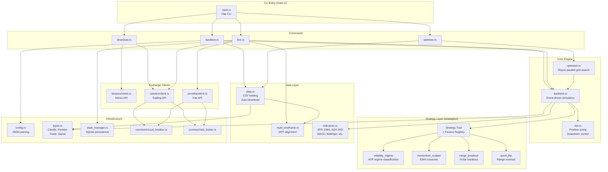
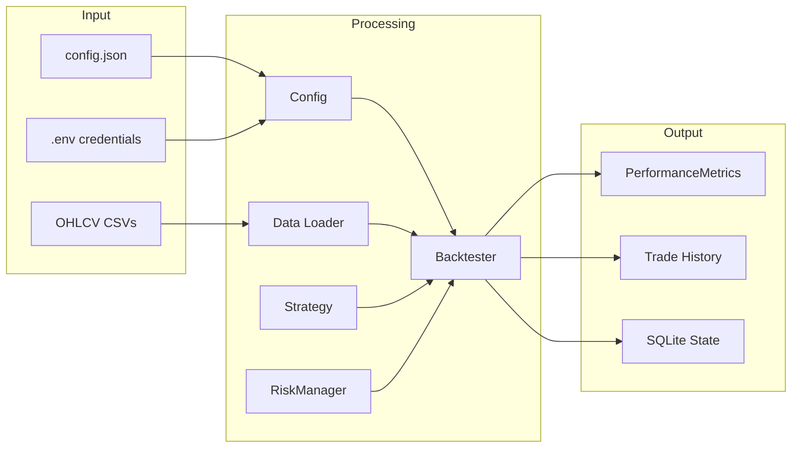

# Crypto Strategies - Rust Implementation

High-performance Rust implementation with **production-grade Order Management System (OMS)** for backtesting and live trading.

## 🎯 OMS Architecture (New in 2026)

The system has been upgraded with a complete Order Management System that enables:
- **Order lifecycle management**: Pending → Submitted → Open → Filled/Cancelled
- **Intra-candle fill detection**: Buy limit fills if `candle.low <= limit_price`
- **FIFO position accounting**: Multiple fills per position with weighted average entry
- **Grid trading support**: Place multiple simultaneous limit orders per symbol
- **Multi-timeframe strategies**: Access multiple timeframes in strategy logic
- **Order-based execution**: Strategies generate orders, not just signals

### OMS Components (`rust/src/oms/`)

**Core Modules:**
- `types.rs` - OrderId (atomic u64), OrderType, OrderState, TimeInForce, Order, Fill, Position
- `orderbook.rs` - BTreeMap-based order book with price-time priority (O(log N) insert)
- `execution.rs` - ExecutionEngine with intra-candle fill detection
- `position_manager.rs` - PositionManager tracking FIFO-weighted P&L  
- `strategy.rs` - StrategyContext with multi-timeframe candles, OrderRequest builders

**Key Dependencies:**
- `ordered-float = "4.2"` - Total ordering for f64 in BTreeMap (required because f64 lacks `Ord` due to NaN)

### Strategy Interface Evolution

**Before (Signal-Based):**
```rust
fn generate_signal(&self, symbol: &Symbol, candles: &[Candle], 
                   position: Option<&Position>) -> Signal
```

**After (Order-Based):**
```rust
fn generate_orders(&self, ctx: &StrategyContext) -> Vec<OrderRequest>
```

**Complete Lifecycle Hooks:**
```rust
trait Strategy {
    fn generate_orders(&self, ctx: &StrategyContext) -> Vec<OrderRequest>;
    fn on_order_filled(&mut self, fill: &Fill, position: &Position);
    fn on_order_cancelled(&mut self, order: &Order);
    fn on_trade_closed(&mut self, trade: &Trade);  // Entry → Exit complete
}
```

### Backtest Engine Rewrite

**Event Loop per Candle:**
1. Check all orders for fills via `ExecutionEngine::check_fill(order, candle)`
2. Update positions with FIFO P&L on fills
3. Notify strategy via `on_order_filled()`
4. Generate new orders via `strategy.generate_orders()`
5. Validate via RiskManager
6. Add to OrderBook
7. Notify strategy via `on_trade_closed()` when position exits

**Critical:** Historical timestamp preservation - fills use `candle.datetime`, NOT `Utc::now()`

## Verified Backtest Results

All strategies backtested with **₹100,000 initial capital** on crypto pairs (BTC, ETH, SOL, BNB, XRP) with INR.
Data period: 2022-01 to 2026-01 (~1493 daily candles per symbol).

### Production Backtest Results (Optimized Parameters)

| Strategy | Timeframe | Sharpe | Return | Post-Tax | Win Rate | Trades | Max DD | Profit Factor |
|----------|-----------|--------|--------|----------|----------|--------|--------|---------------|
| **quick_flip** | 1d | 1.08 | 166.08% | 116.31% | 56.55% | 145 | 13.54% | 2.73 |
| **momentum_scalper** | 1d | 0.55 | 104.13% | 72.95% | 45.65% | 276 | 24.69% | 1.41 |
| **range_breakout** | 1d | 0.71 | 92.74% | 64.92% | 48.28% | 116 | 15.93% | 2.44 |
| **volatility_regime_4h** | 4h | -0.36 | 92.25% | 64.59% | 54.09% | 281 | 18.50% | 1.72 |
| **volatility_regime** | 1d | 0.35 | 42.38% | 29.66% | 52.00% | 50 | 11.92% | 2.04 |
| **regime_grid** | 1d | 0.30 | 31.16% | 22.79% | 82.46% | 57 | 38.34% | 3.73 |

**Key Observations:**
- **quick_flip**: Best overall performer with Sharpe 1.08, 166% return, and 13.5% max DD. Long-only mode with tight stop (1 ATR), wide target (6 ATR)
- **momentum_scalper**: Good returns (104%) with optimized EMA(13/21), tight stop (1.5 ATR), wide target (4 ATR), max hold 30 bars
- **range_breakout**: Solid risk-adjusted returns with 48% win rate but 2.44 profit factor (winners > losers)
- **volatility_regime_4h**: High trade count (281) on 4h timeframe, decent return but negative Sharpe due to volatility
- **volatility_regime**: Conservative with lowest max DD (11.92%), good for risk-averse portfolios
- **regime_grid**: Highest win rate (82%) but large drawdown (38%); excellent profit factor

**Config Files:** All configs are in `../configs/` folder (e.g., `../configs/quick_flip_config.json`)

**Tax Calculation**: 30% flat tax on profits (Indian crypto tax), no loss offset allowed.

*Results verified on 2026-01-08 using OMS-based backtest engine with optimized parameters.*

## Features

- **🎯 Order Management System**: Production-grade OMS with order lifecycle, FIFO P&L, grid trading
- **⚡ Performance**: 10-100x faster backtests enabling thorough optimization
- **🔒 Type Safety**: Compile-time guarantees eliminate runtime type errors
- **📊 Multi-Timeframe**: Strategies access multiple timeframes (e.g., 1d + 4h + 1h)
- **⚙️ Parallel Optimization**: Rayon-based grid search across all CPU cores
- **🏭 Production Ready**: Circuit breakers, rate limiting, state persistence
- **🌐 Multiple Exchanges**: CoinDCX (crypto) and Zerodha Kite (equity)

## Architecture Highlights

**Module Organization:**
- `src/oms/` - Order management system (new)
- `src/strategies/` - Trading strategies (all migrated to OMS API)
- `src/backtest.rs` - Backtesting engine (rewritten for OMS)
- `src/risk.rs` - Risk management (drawdown, position limits)
- `src/types.rs` - Core domain types (Candle, Symbol, Side, Trade, PerformanceMetrics)
- `src/indicators.rs` - Technical indicators (ATR, EMA, RSI, ADX, etc.)
- `src/data.rs` - CSV data loading and validation
- `src/multi_timeframe.rs` - Multi-timeframe data management
- `src/coindcx/` - CoinDCX exchange integration
- `src/zerodha/` - Zerodha Kite integration

**Key Design Decisions:**
- **Why `types.rs` at root?** Core domain primitives used across all modules
- **Why `risk.rs` at root?** Cross-cutting concern orchestrating OMS, strategies, portfolio
- **Why ordered-float?** BTreeMap requires `Ord` trait; f64 doesn't have it (NaN); OrderedFloat provides total ordering

## Prerequisites

- [Rust toolchain](https://rustup.rs/) (1.70+)
- API credentials (CoinDCX for crypto, Zerodha for equity)

## Quick Start

```bash
cd rust

# Build (debug for development)
cargo build

# Build (release for production/optimization)
cargo build --release

# Run tests
cargo test
```

### Environment Configuration

```bash
# Create .env from template (in repo root)
copy ..\.env.example ..\.env  # Windows

# Add credentials
COINDCX_API_KEY=your_api_key_here
COINDCX_API_SECRET=your_api_secret_here
ZERODHA_API_KEY=your_kite_api_key
ZERODHA_ACCESS_TOKEN=your_access_token
```

## Commands

### Download Historical Data

```bash
# Download from Binance (default, no auth required)
cargo run -- download --symbols BTC,ETH,SOL --timeframes 5m,15m,1h,1d --days 180

# Download from CoinDCX
cargo run -- download --symbols BTC,ETH --timeframes 1h,1d --days 90 --source coindcx

# Download specific date range
cargo run -- download --symbols BTC --timeframes 1d --start 2023-01-01 --end 2024-01-01
```

### Backtesting

```bash
# Run backtest
cargo run -- backtest --config ../configs/btc_eth_sol_bnb_xrp_1d.json

# With date range filter
cargo run -- backtest --config ../configs/sample_config.json --start 2024-01-01 --end 2024-12-31

# Override capital
cargo run -- backtest --config ../configs/sample_config.json --capital 50000

# Verbose output
cargo run -- backtest -v
```

**Monthly P&L Matrix**: The backtest output now includes a professional month-on-month profit/loss matrix, displaying:
- Monthly P&L for each year in tabular format
- Color-coded profits (green) and losses (red) 
- Yearly totals and monthly win rate statistics
- Easy visualization of seasonal patterns and consistency

Example output (volatility_regime strategy):
```
========================================================================================================================
MONTHLY P&L MATRIX (₹)
========================================================================================================================
  Year │        Jan │        Feb │        Mar │        Apr │        May │        Jun │        Jul │        Aug │        Sep │        Oct │        Nov │        Dec │        Total
------------------------------------------------------------------------------------------------------------------------
  2022 │            │   -2779.91 │            │    -586.50 │            │            │            │            │            │            │    2541.41 │   -3493.75 │     -4318.76
  2023 │            │     547.06 │   -4885.68 │    2809.58 │    -662.67 │            │    -222.71 │            │            │    5813.94 │    4939.78 │   13462.24 │     21801.54
  2024 │     604.20 │    8302.44 │   15456.90 │   -4906.20 │    1726.33 │    -347.22 │   -4772.28 │    -387.07 │            │            │    3171.42 │   -2489.58 │     16358.94
  2025 │            │            │            │            │   -1805.17 │   -2347.70 │    1429.88 │    -745.44 │    9009.92 │    2994.66 │            │            │      8536.15
========================================================================================================================
Total P&L: ₹42377.87
Monthly Win Rate: 50.0% (14 profitable / 14 losing / 28 total months)
========================================================================================================================
```

### Optimization

Grid parameters are defined in your config's `grid` section:

```json
{
  "grid": {
    "_optimization": [{
      "sharpe_ratio": 0.96,
      "total_return": 100.2,
      "max_drawdown": 13.6,
      "win_rate": 47.3,
      "total_trades": 55,
      "calmar_ratio": 1.39,
      "expectancy": 1853.29,
      "symbols": ["BTCINR", "ETHINR", "SOLINR"],
      "optimized_at": "2026-01-01 22:10:06"
    }],
    "ema_fast": [8, 13],
    "ema_slow": [21, 34],
    "stop_atr_multiple": [2.0, 2.5, 3.0]
  }
}
```

The `_optimization` field is auto-updated when better results are found, storing metrics and the exact symbols used.

```bash
# Run optimization (uses grid from config)
cargo run --release -- optimize --config ../configs/sample_config.json

# Test multiple coin combinations
cargo run --release -- optimize --coins BTC,ETH,SOL,BNB --min-combo 2

# Test specific symbol groups
cargo run --release -- optimize --symbols "BTC,ETH;SOL,BNB,XRP"

# Test multiple timeframes
cargo run --release -- optimize --timeframes 1h,4h,1d

# Override grid params via CLI
cargo run --release -- optimize -O "adx_threshold=20,25,30" -O "ema_fast=5,8,13"

# Sort by different metrics
cargo run --release -- optimize --sort-by calmar
cargo run --release -- optimize --sort-by return

# Show top N results
cargo run --release -- optimize --top 20

# Skip auto-update of config
cargo run --release -- optimize --no-update
```

**Sorting Options:**

| Option | Description |
|--------|-------------|
| `sharpe` | Risk-adjusted return (default) |
| `calmar` | Return / Max Drawdown |
| `return` | Raw total return |
| `profit_factor` | Gross profits / Gross losses |
| `win_rate` | Winning trades % |
| `expectancy` | Average trade expectancy |

### Live Trading

```bash
# Paper trading (safe, simulated)
cargo run -- live --config ../configs/sample_config.json --paper

# Custom cycle interval (seconds)
cargo run -- live --paper --interval 300

# Live trading with real money (CAUTION!)
cargo run -- live --live
```

## Architecture



### Module Dependency Flow



### Live Trading Event Loop

```mermaid
stateDiagram-v2
    [*] --> Init: cargo run -- live
    Init --> Bootstrap: Load config + credentials
    Bootstrap --> Recovery: Load SQLite state
    Recovery --> FetchCandles: Bootstrap historical candles

    FetchCandles --> TradingLoop: Start async loop

    state TradingLoop {
        [*] --> FetchLatest
        FetchLatest --> CheckPositions: Update MTF candles
        CheckPositions --> CheckStops: For each symbol
        CheckStops --> CheckTargets: Stop loss check
        CheckTargets --> UpdateTrailing: Take profit check
        UpdateTrailing --> GenerateSignal: Trailing stop
        GenerateSignal --> ExecuteTrade: Strategy signal
        ExecuteTrade --> SaveState: Open/Close position
        SaveState --> [*]: Checkpoint to SQLite
    }

    TradingLoop --> Shutdown: Ctrl+C
    Shutdown --> ClosePositions: Graceful exit
    ClosePositions --> SaveFinal: Close all positions
    SaveFinal --> [*]: Final checkpoint
```



### Directory Structure

```
src/
├── main.rs                  # CLI entry point (clap)
├── lib.rs                   # Library exports
│
├── commands/                # Command implementations
│   ├── backtest.rs          # Historical simulation (OMS-based)
│   ├── optimize.rs          # Grid search optimization
│   ├── live.rs              # Real-time trading (async, OMS migration in progress)
│   └── download.rs          # Data fetching
│
├── oms/                     # Order Management System (NEW)
│   ├── mod.rs               # Module exports
│   ├── types.rs             # Order, Fill, Position types
│   ├── orderbook.rs         # BTreeMap-based order book
│   ├── execution.rs         # Fill detection engine
│   ├── position_manager.rs  # FIFO position tracking
│   └── strategy.rs          # StrategyContext, OrderRequest
│
├── strategies/              # Strategy implementations (all migrated to OMS)
│   ├── mod.rs               # Strategy trait + factory registry
│   ├── volatility_regime/   # ATR regime classification
│   ├── momentum_scalper/    # EMA crossover momentum
│   ├── range_breakout/      # N-bar high/low breakout
│   ├── quick_flip/          # Multi-timeframe reversal (4h+1d)
│   └── regime_grid/         # Grid trading with regime adaptation
│
├── binance/                 # Binance API (data only)
│   ├── client.rs            # Klines fetching
│   └── types.rs             # API types
│
├── coindcx/                 # CoinDCX API (trading)
│   ├── client.rs            # REST client with retries
│   ├── auth.rs              # HMAC-SHA256 signing
│   ├── circuit_breaker.rs   # Fault tolerance
│   └── rate_limiter.rs      # Token bucket
│
├── zerodha/                 # Zerodha Kite API (equity)
│   ├── client.rs            # HFT-grade client
│   ├── auth.rs              # OAuth handling
│   └── types.rs             # Kite types
│
├── common/                  # Shared utilities
│   ├── circuit_breaker.rs   # Generic circuit breaker
│   └── rate_limiter.rs      # Generic rate limiter
│
├── backtest.rs              # Event-driven simulation engine
├── optimizer.rs             # Rayon parallel optimization
├── grid.rs                  # Parameter grid generation
├── risk.rs                  # Position sizing + drawdown
├── indicators.rs            # 25+ technical indicators
├── config.rs                # JSON configuration parsing
├── types.rs                 # Domain model (Candle, Position, Trade)
├── data.rs                  # CSV loading + Binance download
├── state_manager.rs         # SQLite persistence + recovery
├── multi_timeframe.rs       # MTF data container
└── monthly_pnl.rs           # P&L matrix generation
```

## Available Strategies

| Strategy | Description | Best Timeframe | Sharpe | Max DD | Key Feature |
|----------|-------------|----------------|--------|--------|-------------|
| `volatility_regime` | ATR-based regime classification | 1d | 0.35 | 11.92% | Volatility clustering |
| `regime_grid` | Grid trading with regime adaptation | 1d | 0.30 | 38.34% | High win rate (82%) |
| `range_breakout` | N-bar high/low breakout | 1d | -0.17 | 7.62% | Lowest drawdown |
| `momentum_scalper` | EMA crossover momentum | 1d | -1.60 | 29.65% | Needs optimization |
| `quick_flip` | Range reversal/breakout | 1d | N/A | N/A | Pattern recognition |

### Quick Flip Strategy

Range-based reversal and breakout strategy:
- **Range Box**: Uses `opening_bars` to define price range (high/low)
- **Entry**: Price breaks outside range with reversal candle OR breakout continuation
- **ATR Filter**: Optional minimum range as % of ATR
- **Exit**: Signal candle extreme (stop), range boundary (target)
- **Best Config**: 1d timeframe, 50-bar lookback, Sharpe 0.26

### Volatility Regime Strategy

ATR-based regime classification for adaptive trading:
- **Regime Detection**: Compression (<0.6 ATR), Normal, Expansion (>1.5 ATR), Extreme (>2.5 ATR)
- **Entry**: Compression or Normal regime with EMA trend + ADX confirmation
- **Exit**: Trailing stop, take profit, or regime exit (Extreme)
- **Best Config**: 1d timeframe, EMA 8/21, Sharpe 0.55

## Creating a New Strategy

### Step 1: Create Strategy Directory

```
src/strategies/my_strategy/
├── mod.rs
├── config.rs
└── strategy.rs
```

### Step 2: Define Config (`config.rs`)

```rust
use serde::{Deserialize, Serialize};

#[derive(Debug, Clone, Serialize, Deserialize)]
pub struct MyStrategyConfig {
    pub param1: usize,
    pub param2: f64,
}

impl Default for MyStrategyConfig {
    fn default() -> Self {
        Self { param1: 14, param2: 2.5 }
    }
}
```

### Step 3: Implement Strategy (`strategy.rs`)

```rust
use crate::strategies::Strategy;
use crate::{Candle, Position, Signal, Symbol};

pub struct MyStrategy {
    config: MyStrategyConfig,
}

impl Strategy for MyStrategy {
    fn name(&self) -> &'static str { "my_strategy" }

    fn generate_signal(
        &self,
        symbol: &Symbol,
        candles: &[Candle],
        position: Option<&Position>,
    ) -> Signal {
        // Your logic here
        Signal::Flat
    }

    fn calculate_stop_loss(&self, candles: &[Candle], entry_price: f64) -> f64 {
        entry_price * 0.95
    }

    fn calculate_take_profit(&self, candles: &[Candle], entry_price: f64) -> f64 {
        entry_price * 1.10
    }

    fn update_trailing_stop(
        &self,
        position: &Position,
        current_price: f64,
        candles: &[Candle],
    ) -> Option<f64> {
        None
    }
}
```

### Step 4: Register in `src/strategies/mod.rs`

```rust
pub mod my_strategy;

// In get_registry():
map.insert("my_strategy", my_strategy::create as StrategyFactory);
```

## Multi-Timeframe Support

Strategies can declare required timeframes:

```rust
impl Strategy for QuickFlipStrategy {
    fn required_timeframes(&self) -> Vec<String> {
        vec!["1d".to_string(), "15m".to_string(), "5m".to_string()]
    }

    fn generate_signal_mtf(
        &self,
        symbol: &Symbol,
        mtf_candles: &MultiTimeframeCandles,
        position: Option<&Position>,
    ) -> Signal {
        let daily = mtf_candles.get("1d").unwrap();
        let m15 = mtf_candles.get("15m").unwrap();
        let m5 = mtf_candles.get("5m").unwrap();
        // Use all timeframes for decision
    }
}
```

## Configuration Structure

```json
{
  "exchange": {
    "maker_fee": 0.001,
    "taker_fee": 0.001,
    "assumed_slippage": 0.001,
    "rate_limit": 10
  },
  "trading": {
    "pairs": ["BTCINR", "ETHINR"],
    "initial_capital": 100000,
    "risk_per_trade": 0.15,
    "max_positions": 5,
    "max_portfolio_heat": 0.30,
    "max_position_pct": 0.20,
    "max_drawdown": 0.20,
    "drawdown_warning": 0.10,
    "drawdown_critical": 0.15,
    "consecutive_loss_limit": 3,
    "consecutive_loss_multiplier": 0.75
  },
  "strategy": {
    "name": "volatility_regime",
    "timeframe": "1d",
    "atr_period": 14,
    "ema_fast": 8,
    "ema_slow": 21
  },
  "tax": {
    "tax_rate": 0.30,
    "tds_rate": 0.01,
    "loss_offset_allowed": false
  },
  "backtest": {
    "data_dir": "../data",
    "results_dir": "../results",
    "start_date": "2022-01-01",
    "end_date": "2025-12-31"
  },
  "grid": {
    "_optimization": [{ "sharpe_ratio": 0.96, "symbols": [...], ... }],
    "ema_fast": [8, 13],
    "ema_slow": [21, 34]
  }
}
```

## Risk Management

The risk manager enforces:

| Rule | Default | Description |
|------|---------|-------------|
| Max Drawdown | 20% | Hard halt on trading |
| Drawdown Warning | 10% | 50% position size reduction |
| Drawdown Critical | 15% | 25% position size reduction |
| Consecutive Losses | 3 | 75% position size reduction |
| Max Positions | 5 | Concurrent open positions |
| Max Position % | 20% | Single position capital limit |
| Portfolio Heat | 30% | Total risk exposure limit |

## Exchange Integrations

### CoinDCX (Crypto)
- HMAC-SHA256 authentication
- Circuit breaker for fault tolerance
- Rate limiting (token bucket)
- Exponential backoff retries

### Zerodha Kite (Equity)
- OAuth authentication
- HFT-grade optimizations
- NSE/BSE support
- Production-ready, fully decoupled

### Binance (Data Only)
- Public API, no auth required
- Historical kline fetching
- Auto-pagination for large ranges

## Testing

```bash
cargo test                    # Run all tests
cargo test --release          # With optimizations
cargo test -- --nocapture     # Show output
cargo test strategies::       # Test strategies module
```

## Performance

- **Backtest Speed**: 10-100x faster than Python
- **Parallelization**: Automatic across all CPU cores
- **Memory**: Windowed history (300-bar lookback)
- **Release Build**: LTO enabled, single codegen unit

## License

MIT License
